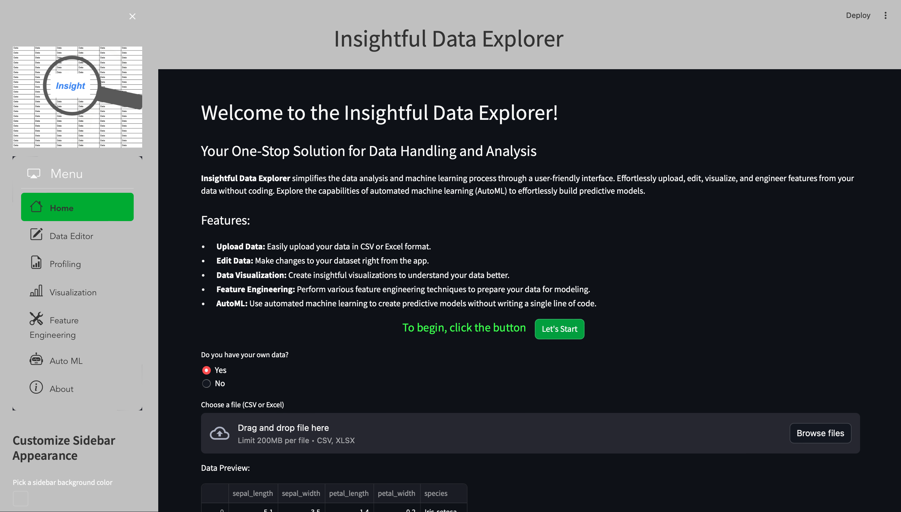

#  Insightful Data Explorer

Welcome to the Data Explorer and Machine Learning App! This Streamlit-based application provides a comprehensive suite of tools for data analysis, visualization, feature engineering, and automated machine learning (AutoML).

## Table of Contents
- [Features](#features)
- [Contributing](#contributing)

## Features
- **Data Handling**: Upload CSV or Excel files, edit data, and perform preprocessing tasks.
- **Visualization**: Create custom visualizations and use AutoViz for automated chart generation.
- **Feature Engineering**: Transform and create new features, handle missing values, outliers, and more.
- **AutoML**: Automate model selection, training, and optimization for regression, classification, clustering, anomaly detection, and time series forecasting with PyCaret.
- **Profiling**: Generate detailed data profiles using YData Profiling.

## Technologies
- **Streamlit**: Interactive and responsive user interface.
- **PyCaret**: Automated machine learning.
- **PygWalker**: Customizable data visualizations.
- **AutoViz**: Automated chart selection.
- **YData Profiling**: Detailed data profiling.

---
